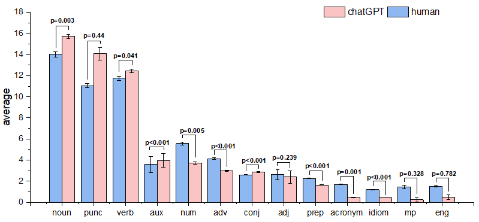
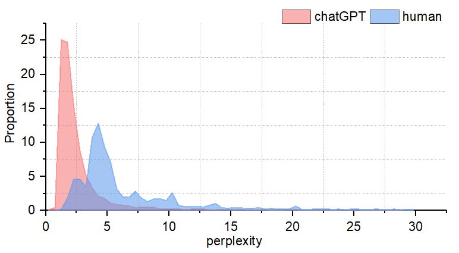

**The project involves technology:**
+ mysql
+ python
+ origin
+ spss

| file  |  describe |
| ------------ | ------------ |
| q&a.sql  | Question & answer pairs raw data, including title(question sample), chatGPT response (ai_reply), human answer (reply), perplexity value of human answer and perplexity value of chatGPT response (ai_ppl)  |
|  q&a_corpus.sql | Human answer and chatGPT response Part-of-Speech classification table  |


First, run the `database.sql` file to create a data table, and then import data from `q&a.sql` and `q&a_corpus.sql` into the data table.

run this sql, You will receive the raw data of Figure 2.
```sql
SELECT 
    COUNT(1) / 5219 num, type, corpus
FROM
    chatgpt.chatgpt_qa_corpus
GROUP BY type , corpus
ORDER BY num DESC , corpus;
```
After processing the data in the origin, you will get Figure 2. Of course, you can also directly run origin project/paper3_ figure2.opj to get figure2.png

[](figure2.png "figure2.png")

You can compare human in Excel or other tools to conduct statistics on human_ppl and ai_ppl, or you can directly run origin project/paper3_ figure 3.opj obtains figure 3.png

[](figure3.png "figure3.png")
